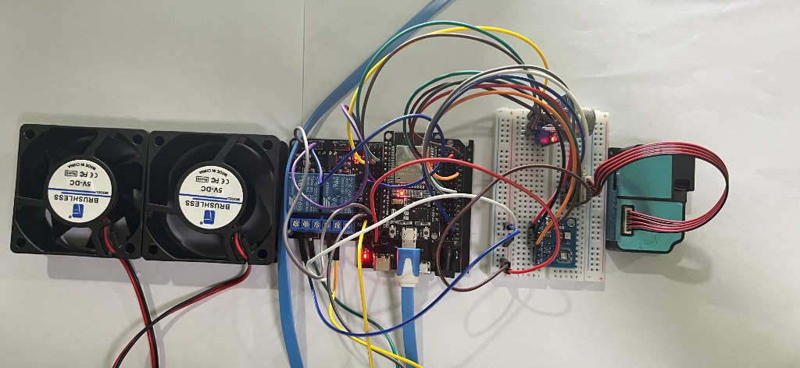
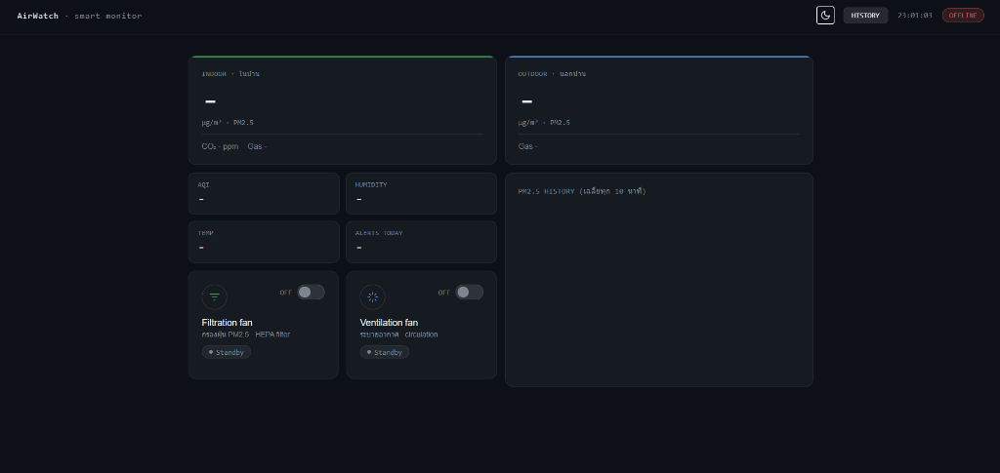

# IoT Smart Power Management & Monitoring System

An IoT project for monitoring air quality in real-time with automatic fan control. It uses an ESP32 board to read data from multiple sensors and sends it to a Node.js server, which stores everything in a MySQL database and shows it on a web dashboard.

> **Note:** This is a prototype tested in a simulated room. We use small 5V DC fans instead of real ventilation fans just to demonstrate how the system works.

<p align="center">
  
</p>
<p align="center"><em>Hardware setup: ESP32, PMS5003 sensor, and 5V DC Brushless fans</em></p>

<p align="center">
  
</p>
<p align="center"><em>Web Dashboard showing real-time air quality data</em></p>

---

## Features

- **Air Quality Monitoring:** Reads PM2.5, CO2, gas, temperature, and humidity from multiple sensors
- **Real-time Updates:** Sensor data is pushed to the dashboard via WebSocket (Socket.IO), no need to refresh the page
- **Auto Fan Control:** The system turns on 5V DC fans (simulating filtration and ventilation fans) automatically when pollution goes above the threshold, and turns them off when air quality is back to normal
- **AQI Calculation:** Calculates Air Quality Index based on US EPA standard and shows it on the dashboard
- **Data History:** Logs all sensor data to MySQL and shows PM2.5 history as a line chart using Chart.js
- **Alerts:** Shows warnings on screen when PM2.5 is at a dangerous level, and keeps a log of past alerts
- **Light/Dark Mode:** You can switch between light and dark theme

---

## Hardware

- **Board:** ESP32 (with WiFi)
- **Sensors:**
    - PMS5003 — laser dust sensor for PM2.5 (Serial/UART)
    - AHT10 — temperature and humidity sensor (I2C)
    - ENS160 — digital air quality sensor for CO2/eCO2/TVOC (I2C)
    - MQ-2 — analog gas/smoke sensor
- **Fans:** 2x small 5V DC Brushless fans (simulating filtration fan and ventilation fan)
- **Actuator:** Relay module for controlling the fans on/off

---

## Tech Stack

- Firmware: C++ (Arduino IDE)
- Backend: Node.js, Express.js
- Real-time: Socket.IO
- Database: MySQL
- Frontend: HTML5, CSS3, JavaScript
- Charts: Chart.js

---

## Project Structure

- `frimware.ino` — ESP32 firmware, reads sensor data and sends HTTP POST to the server
- `server.js` — Node.js server, handles API, saves data to DB, pushes real-time updates, and serves the web pages
- `index.html` — main dashboard page with current data and last 20 readings chart
- `history.html` — history page with detailed data and daily summary
- `style.css` — all the styling for the website
- `package.json` — Node.js dependencies

---

## How to Run

### 1. Database Setup
1. Install MySQL (e.g. XAMPP or standalone MySQL)
2. Create a database called `smart_air_db`
3. Create a `sensor_data` table with these fields: `in_pm25`, `in_co2`, `in_gas`, `out_pm25`, `out_gas`, `vent_fan_status`, `filt_fan_status`, `temperature`, `humidity`, `created_at`

### 2. Backend Setup
1. Open terminal in the project folder
2. Install dependencies:
   ```bash
   npm install
   ```
3. Edit the database connection in `server.js`:
   ```javascript
   const db = mysql.createPool({
       host: 'localhost',
       user: 'root',
       password: 'your_password',
       database: 'smart_air_db'
   });
   ```
4. Start the server:
   ```bash
   node server.js
   ```
   Server runs on port 3000

### 3. Firmware Setup
1. Open `frimware.ino` in Arduino IDE
2. Install these libraries: `HTTPClient`, `Adafruit AHTX0`, `SparkFun ENS160`, `PMS Library`
3. Change WiFi and server URL in the code:
   ```cpp
   const char* ssid = "your_wifi_name";
   const char* password = "your_wifi_password";
   const char* serverUrl = "http://your_server_ip:3000/api/log";
   ```
4. Select ESP32 board, pick the right port, and upload

### 4. Open the Dashboard
Once the server is running and ESP32 is connected to WiFi, open your browser and go to `http://localhost:3000` or `http://[your_server_ip]:3000` from another device on the same network.
